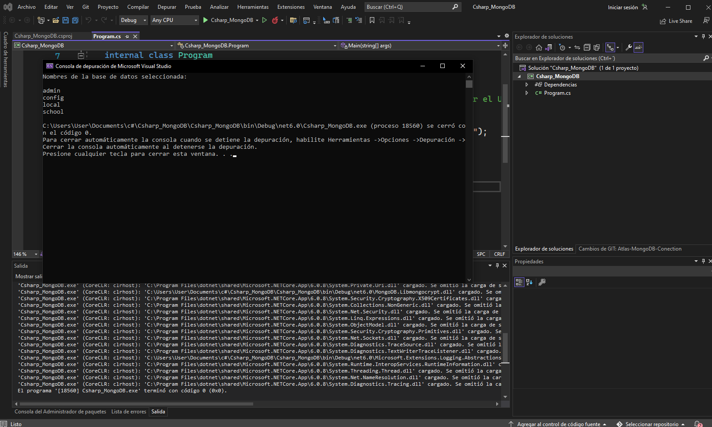

# Conexión a MongoDB Atlas en C#

Para que se de la conexión al MongoDB con C#, se deben de realizar los siguientes procedimientos:

## Instalación del paquete de MongoDB

Para esta ocasión, se usará el IDE de [**Visual Studio**](https://visualstudio.microsoft.com/es/downloads/) (cualquier versión).

Dentro del *Visual Studio Installer*, en el apartado de **Móviles y de escritorio**, seleccione la opción de **Desarrollo de escritorio de .NET** para que se obtengan las herramientas necesarias en la ejecución del proyecto de C#.

1. Crear un proyecto.
1. En el apartado superior, haga seleccione `Herramientas` y luego `Administrador de paquetes NuGet`.
1. Para instalar el paquete, escriba en la consola que se mostrará: 
```
Install-Package MongoDB.Driver
```

## Conexión con la API

Una vez ya hecho esto, simplemente debe importar las siguientes librerías:
```
using MongoDB.Bson;
using MongoDB.Driver;
```

Y, finalmente, puede ya hacer la conexión como el siguiente ejemplo

```
var client = new MongoClient("mongodb://localhost:27017"); //Cambiar el URI al database que desea usar
            using (IAsyncCursor<BsonDocument> cursor = client.ListDatabases())
            {
                Console.WriteLine("Nombres de la base de datos seleccionada: \n");
                while (cursor.MoveNext())
                {
                    foreach (var doc in cursor.Current)
                    {
                        Console.WriteLine(doc["name"]);
                    }
                }
            }
```
Como demostración, se ha hecho una conexión en el presente repositorio que tiene como output la relación de los nombres de bases de datos según la URI mostrada.



Si ocurre el output mostrado, entonces se encuentra correctamente conectado.
